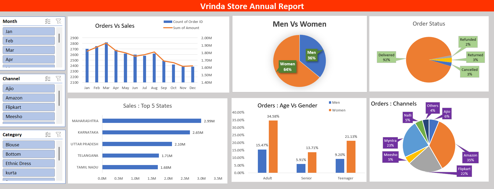

# Vrinda Store Annual Report 📊

## 📌 Project Overview  
This project is an **annual sales analysis of Vrinda Store** created using **Excel**.  
The goal of this report is to understand customer behavior, identify key sales trends, and help the business make data-driven decisions.  

---

## 🛠 Tools Used  
- **Microsoft Excel** → Data cleaning, analysis, and dashboard creation  
- **Pivot Tables & Charts** → For summarizing and visualizing data  
- **Excel Functions** → Used for calculations and insights  

---

## 📈 Dashboard Preview  
Below is a snapshot of the interactive Excel dashboard:  

  

---

## 🔑 Key Insights  
- **Women customers** are more likely to purchase compared to men (~65%).  
- **Top states** contributing to sales: Maharashtra, Karnataka, and Uttar Pradesh.  
- **Adult age group (30–49 yrs)** contributes the most to sales.  
- **Amazon, Flipkart, and Myntra** are the top contributing channels.  

---

## 🎯 Final Recommendation  
Targeting **Women customers aged 30–49 years** living in **Maharashtra, Karnataka, and Uttar Pradesh**, and promoting through **Amazon, Flipkart, and Myntra** will help Vrinda Store improve sales.  

---

## 📂 Files in this Repository  
- `Vrinda_Store_Annual_Report.xlsx` → Excel file with complete analysis and dashboard  
- `Dashboard_Screenshot.png` → Snapshot of the dashboard  
- `README.md` → Project documentation  
- `LICENSE` → License details  

---

✨ *This project is a part of my portfolio showcasing data analysis using Excel.*  
